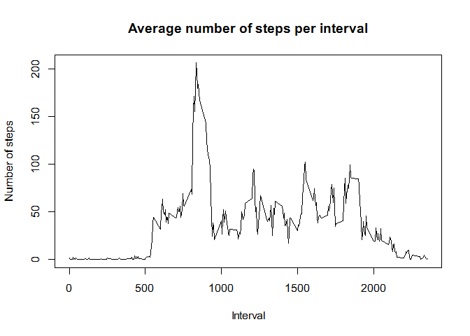
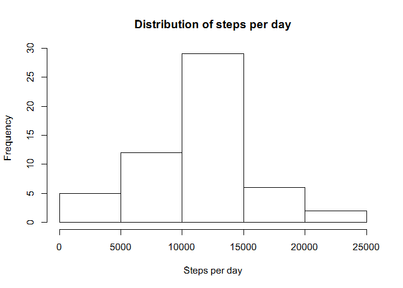
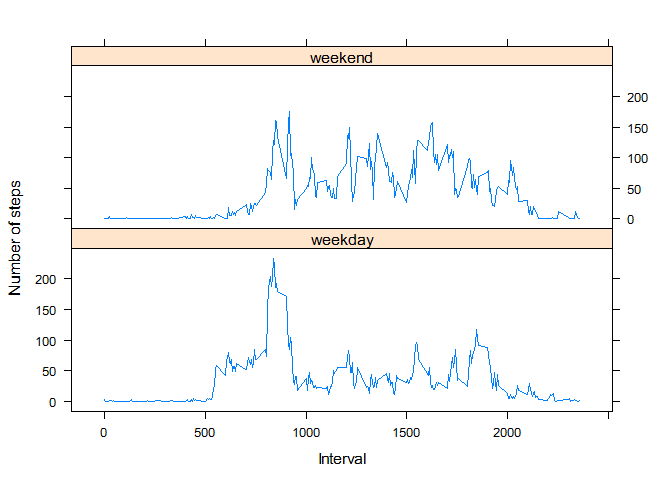

# Reproductible research peer assignment 1
Joris Schut  
Monday, March 02, 2015  

## Loading and preprocessing the data

Show any code that is needed to

Load the data (i.e. read.csv())

```r
library(lattice)

#Download the file (if not already done)
if (!file.exists("activity.csv")) {
  url  = "https://d396qusza40orc.cloudfront.net/repdata%2Fdata%2Factivity.zip"
  dest = "activity.zip"
  meth = "internal"
  quit = TRUE
  mode = "wb"
  download.file(url, dest, meth, quit, mode)
  #Works on tested operating system (Windows 7). Please change values if needed.
  unzip("activity.zip")
  remove.file("activity.zip")
  }  

activity <- read.csv("activity.csv", na.strings="NA")
```

Process/transform the data (if necessary) into a format suitable for your analysis

```r
activity$date <- as.Date(activity$date, "%Y-%m-%d")
```

## What is mean total number of steps taken per day?

For this part of the assignment, you can ignore the missing values in the dataset.

Calculate the total number of steps taken per day

```r
stepstotalbydate <- aggregate(steps ~ date, data=activity, sum, na.rm = TRUE)
```

If you do not understand the difference between a histogram and a barplot, research the difference between them. Make a histogram of the total number of steps taken each day

```r
hist(stepstotalbydate$steps, main="Distribution of steps per day", xlab="Steps per day")
```

 

Calculate and report the mean and median of the total number of steps taken per day

```r
mean_steps_per_day <- mean(stepstotalbydate$steps, na.rm=TRUE)
median_steps_per_day <- median(stepstotalbydate$steps, na.rm=TRUE)
print(paste("Average number of steps per day:", mean_steps_per_day, sep=" "))
```

```
## [1] "Average number of steps per day: 10766.1886792453"
```

```r
print(paste("Median of steps per day:", median_steps_per_day, sep=" "))
```

```
## [1] "Median of steps per day: 10765"
```

## What is the average daily activity pattern?

Make a time series plot (i.e. type = "l") of the 5-minute interval (x-axis) and the average number of steps taken, averaged across all days (y-axis)

```r
stepsmeanbyinterval <- aggregate(steps ~ interval, data=activity, mean, na.rm = TRUE)

plot(stepsmeanbyinterval$interval, stepsmeanbyinterval$steps,
     type="l", main="Average number of steps per interval",
     xlab="Interval", ylab="Number of steps")
```

 

Which 5-minute interval, on average across all the days in the dataset, contains the maximum number of steps?

```r
a <- max(stepsmeanbyinterval$steps)
a <- stepsmeanbyinterval$steps == a
interval_maxsteps <- stepsmeanbyinterval$interval[a]
rm(a)
print(paste("Interval containing the highest number of steps:",
            interval_maxsteps, sep=" "))
```

```
## [1] "Interval containing the highest number of steps: 835"
```

## Imputing missing values

Note that there are a number of days/intervals where there are missing values (coded as NA). The presence of missing days may introduce bias into some calculations or summaries of the data.

Calculate and report the total number of missing values in the dataset (i.e. the total number of rows with NAs)

```r
numberNA <- sum(is.na(activity))
print(paste("total number of NA's:", numberNA, sep=" "))
```

```
## [1] "total number of NA's: 2304"
```

```r
numberNAsteps <- sum(is.na(activity$steps))
print(paste("total number of NA's in the 'steps' column:", numberNAsteps, sep=" "))
```

```
## [1] "total number of NA's in the 'steps' column: 2304"
```

```r
if(numberNA == numberNAsteps){
  print("All NA's are in the steps column")
}
```

```
## [1] "All NA's are in the steps column"
```

Devise a strategy for filling in all of the missing values in the dataset. The strategy does not need to be sophisticated. For example, you could use the mean/median for that day, or the mean for that 5-minute interval, etc.

**In case of a NA, it was replaced by the mean of the average number of steps at that interval**


```r
newsteps <- as.numeric()
for(i in 1:length(activity$steps)){
  if(is.na(activity$steps[i] == TRUE)){
    newsteps <- append(newsteps, stepsmeanbyinterval$steps[i])
  }
  else{
    newsteps <- append(newsteps, activity$steps[i])
  }
}
```

Create a new dataset that is equal to the original dataset but with the missing data filled in.

```r
newactivity <- as.data.frame(matrix(newsteps, ncol=1))
names(newactivity)[1]<-paste("steps")
newactivity <- cbind(newactivity, activity[,2:3])
newactivity$date <- as.Date(newactivity$date, "%Y-%m-%d")
```

Make a histogram of the total number of steps taken each day and Calculate and report the mean and median total number of steps taken per day. Do these values differ from the estimates from the first part of the assignment? What is the impact of imputing missing data on the estimates of the total daily number of steps?

```r
newstepstotalbydate <- aggregate(steps ~ date, data=newactivity, sum, na.rm = TRUE)

hist(newstepstotalbydate$steps, main="Distribution of steps per day", xlab="Steps per day")
```

 

```r
newmean_steps_per_day <- mean(newstepstotalbydate$steps, na.rm=TRUE)
newmedian_steps_per_day <- median(newstepstotalbydate$steps, na.rm=TRUE)
print(paste("Average number of steps per day:", newmean_steps_per_day, sep=" "))
```

```
## [1] "Average number of steps per day: 10766.1886792453"
```

```r
print(paste("Median of steps per day:", newmedian_steps_per_day, sep=" "))
```

```
## [1] "Median of steps per day: 10765.5943396226"
```

```r
difmean <- abs(mean_steps_per_day-newmean_steps_per_day)
difmedian <- abs(median_steps_per_day-newmedian_steps_per_day)
print(paste("Difference in means between old and new dataset:",
            difmean, sep=" "))
```

```
## [1] "Difference in means between old and new dataset: 0"
```

```r
print(paste("Difference in median between old and new dataset:",
            difmedian, sep=" "))
```

```
## [1] "Difference in median between old and new dataset: 0.594339622641201"
```

## Are there differences in activity patterns between weekdays and weekends?

For this part the weekdays() function may be of some help here. Use the dataset with the filled-in missing values for this part.

Create a new factor variable in the dataset with two levels - "weekday" and "weekend" indicating whether a given date is a weekday or weekend day.

```r
days <- weekdays(newactivity$date)

for(i in 1:length(days)){
  if(days[i]=="Saturday" | days[i]=="Sunday"){
  days[i] <- "weekend"
  }
  else{
    days[i] <- "weekday"
  }
}

days <- factor(days)
newactivity <- cbind(newactivity, days)
names(newactivity)[4]<-paste("type_of_day")
```

Make a panel plot containing a time series plot (i.e. type = "l") of the 5-minute interval (x-axis) and the average number of steps taken, averaged across all weekday days or weekend days (y-axis). See the README file in the GitHub repository to see an example of what this plot should look like using simulated data.

```r
stepsmeanbydaytype <- aggregate(steps ~ interval + type_of_day, data=newactivity,
                                mean, na.rm = TRUE)

xyplot(steps ~ interval | type_of_day, stepsmeanbydaytype, type="l", layout=c(1, 2), 
       xlab="Interval", ylab="Number of steps")
```

 
