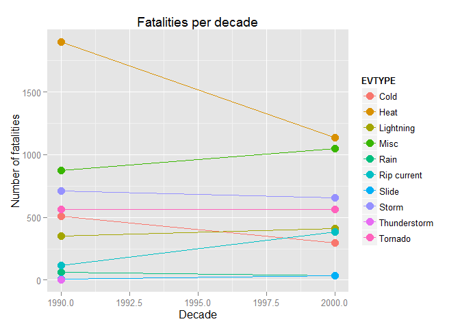
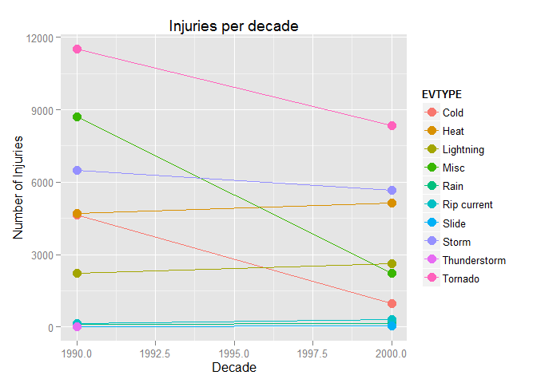
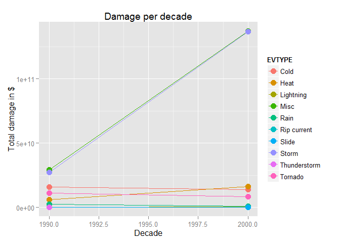

# Changes in the impact of weather related events in the 1990's and 2000's
Joris Schut  
Sunday, February 22, 2015  

##Synopstis
This document tries two answers the following two questions regarding weather in the United States in the 1990's and 2000's:

1. Across the United States, which types of events (as indicated in the EVTYPE variable) are most harmful with respect to population health?
2. Across the United States, which types of events have the greatest economic consequences?

To answer these questions, storm data from the National Weather Service was used. With regard to population heath, heat related events caused the most fatalities in both decades and tornado's were responsible for most injured people. Storms and rains caused most of the combined damage to property and crops in both decades.

##Data processing
###Introduction
This section describes the steps that were taken to create the plots from which conclusions were derived. It starts by loading the data, after which it will process the data. After the processing steps the plots will be generated.

###Step 0: downloading the data
Before Starting with the actual processing the script checks if the data file is present. If this is not the case, the script will download the data set that is used in this analysis. Note that some of the variables in this first block of code might have to be changed for it to work on your operating system. The settings presented in this document were tested on a system running Windows 7 as operating system.

```r
#Download the file (if not already done)
if (!file.exists("repdata-data-StormData.csv.bz2")) {
  url  = "http://d396qusza40orc.cloudfront.net/repdata%2Fdata%2FStormData.csv.bz2"
  dest = "repdata-data-StormData.csv.bz2"
  meth = "internal"
  quit = TRUE
  mode = "wb"
  download.file(url, dest, meth, quit, mode)
  #Works on tested operating system (Windows 7). Please change values if needed.
 } 
```

###Step1: load the libraries and load the dataset into R
In this section the libraries are loaded and the data set is directly loaded into R. The "dplyr" and "ggplot2" libraries were used in this analysis. Dplyr was used to perform select, filter and mutate some variables (see next steps) and ggplot2 was used for plotting the data. Data is loaded into R in character format.

```r
#Load the libraries
library(dplyr)
```

```
## Warning: package 'dplyr' was built under R version 3.1.2
```

```
## 
## Attaching package: 'dplyr'
## 
## The following object is masked from 'package:stats':
## 
##     filter
## 
## The following objects are masked from 'package:base':
## 
##     intersect, setdiff, setequal, union
```

```r
library(ggplot2)
```

```
## Warning: package 'ggplot2' was built under R version 3.1.2
```

```r
#Reads the dataset into R
stormdata <- read.csv(bzfile("repdata-data-StormData.csv.bz2"), header=TRUE, 
                      nrows = 1125211, stringsAsFactor=FALSE, 
                      colClasses = "character", comment.char = "")
```

###Step 2: select the relevant data
In order to reduce the amount of RAM memory that is used by the computer, irrelevant data was discarded. The data that was kept is related to the Date of the measurement, the type of event and the outcomes (fatalities, injuries, property damage and crop damage) of the event.

```r
#Select the data relevant for research question 1 and 2
stormdata <- select(stormdata, BGN_DATE,EVTYPE, FATALITIES:CROPDMGEXP)
```

###Step3: editting the dates of the events
As the dates of the events are formatted as characters, we transformed them to numeric ones. Furthermore, for our analysis we were only interested in dates ranging from 1990 to 2009 (including 2009). Therefore, we first stripped the dates to only the year (discarding information about the day and month on which the event took place) before transforming them into a numeric variable and filtering them. 

```r
#Transform th date colomn into dat format and filter the rows for years from 
#1990 to 2010.
stormdata$BGN_DATE <- sub(".*(....) 0.*", "\\1", stormdata$BGN_DATE,
                          perl=TRUE)

stormdata$BGN_DATE <- as.numeric(stormdata$BGN_DATE)

stormdata <- filter(stormdata, BGN_DATE>=1990 &
                     BGN_DATE<=2009)
```

After filtering, the data was divided in two categories describing the decade from which the data originated (1990's or 2000's).

```r
#Allocate the date to a decade (1990's or 2000's)
stormdata$BGN_DATE[grep("199", stormdata$BGN_DATE)] <- 1990
stormdata$BGN_DATE[grep("200", stormdata$BGN_DATE)] <- 2000
```

###Step4: Calculating damages
In this step the damages inflicted by the events is calculated. This required four sub-steps: transforming the Property damage exponent values to numeric (character class) ones, transforming the Crop damage exponent values to numeric (character class) ones, transforming the relevant classes to integer variables and calculating the damage.

The first sub-step involved the transformation of the Property damage exponent variables so that it only only contained numeric values (still character class). As non-numeric values were present these were transformed into numeric ones. Values that did not contained values other than the ones use in the SI abbreviation system received a exponent value of 0.

```r
#Correcting the PROPDMGEXP column in a value 
stormdata$PROPDMGEXP[grep("K|k", stormdata$PROPDMGEXP)] <- 3
stormdata$PROPDMGEXP[grep("M|m", stormdata$PROPDMGEXP)] <- 6
stormdata$PROPDMGEXP[grep("H|h", stormdata$PROPDMGEXP)] <- 2
stormdata$PROPDMGEXP[grep("B|b", stormdata$PROPDMGEXP)] <- 9
stormdata$PROPDMGEXP[grep("0", stormdata$PROPDMGEXP)] <- 0
stormdata$PROPDMGEXP[grep("1", stormdata$PROPDMGEXP)] <- 1
stormdata$PROPDMGEXP[grep("2", stormdata$PROPDMGEXP)] <- 2
stormdata$PROPDMGEXP[grep("3", stormdata$PROPDMGEXP)] <- 3
stormdata$PROPDMGEXP[grep("4", stormdata$PROPDMGEXP)] <- 4
stormdata$PROPDMGEXP[grep("5", stormdata$PROPDMGEXP)] <- 5
stormdata$PROPDMGEXP[grep("6", stormdata$PROPDMGEXP)] <- 6
stormdata$PROPDMGEXP[grep("7", stormdata$PROPDMGEXP)] <- 7
stormdata$PROPDMGEXP[grep("8", stormdata$PROPDMGEXP)] <- 8
stormdata$PROPDMGEXP[grep("0|1|2|3|4|5|6|7|8|9", stormdata$PROPDMGEXP,
                          invert=TRUE)] <- 0
```

A similar transformation to the Property damage exponent variable was carried out for the Crop damage exponent variable. Values not within the SI system received a exponent value of 0.

```r
#Correcting the CROPDMGEXP column in a value
stormdata$CROPDMGEXP[grep("K|k", stormdata$CROPDMGEXP)] <- 3
stormdata$CROPDMGEXP[grep("M|m", stormdata$CROPDMGEXP)] <- 6
stormdata$CROPDMGEXP[grep("H|h", stormdata$CROPDMGEXP)] <- 2
stormdata$CROPDMGEXP[grep("B|b", stormdata$CROPDMGEXP)] <- 9
stormdata$CROPDMGEXP[grep("0", stormdata$CROPDMGEXP)] <- 0
stormdata$CROPDMGEXP[grep("0|2|3|6|7|8|9", stormdata$CROPDMGEXP,
                          invert=TRUE)] <- 0
```

The class of the relevant variables was changed to integer. This was done to for the calculation of the total damage.

```r
#Change class to intgers
stormdata$PROPDMGEXP <- as.integer(stormdata$PROPDMGEXP)
stormdata$PROPDMG <- as.integer(stormdata$PROPDMG)
stormdata$CROPDMG <- as.integer(stormdata$CROPDMG)
stormdata$CROPDMGEXP <- as.integer(stormdata$CROPDMGEXP)
stormdata$FATALITIES <- as.integer(stormdata$FATALITIES)
stormdata$INJURIES <- as.integer(stormdata$INJURIES)
```

Finally, the total damage was calculated for each entry in the data file. This was don by adding the total damage of property and crops together. These values were calculated by multiplying the damage value by ten to the exponent in the relevant exponent variable. New variables were stored in three new columns.

```r
#Add variables containing the total property damage, total crop damage and
#total damage (property damage + crop damage)
stormdata <- mutate(stormdata, TOTALPRPDMG=PROPDMG*10^PROPDMGEXP)
stormdata <- mutate(stormdata, TOTALCROPDMG=CROPDMG*10^CROPDMGEXP)
stormdata <- mutate(stormdata, TOTALDMG=TOTALPRPDMG+TOTALCROPDMG)
```

###Step5: classifing the events
As the data file contained over nine hundred different classifications in the EVTYPE column, it was necessary to reclassify them. Many categories overlapped (for example, THUNDERSTORM and TSTM). All classifications were placed in one of eleven new classifications (Cold, Storm, Heat, Thunderstorm, Flood, Slide, Tornado, Rain, Rip current, Lightning and Misc) to get a better overall picture. Less than 5% of the entries (91682 entries) ended up in the Misc category. After the categorization the class of this variable was set to a factor.

```r
#Transform the EVTYPE column in 11 different categories
stormdata$EVTYPE <- toupper(stormdata$EVTYPE)

stormdata$EVTYPE[grep("COLD|HAIL|ICE|SNOW|BLIZZARD|FREEZ|GLARE", stormdata$EVTYPE)] <- "Cold"
stormdata$EVTYPE[grep("STORM|HURRICANE|WIND", stormdata$EVTYPE)] <- "Storm"
stormdata$EVTYPE[grep("HEAT|FIRE|DROUGHT", stormdata$EVTYPE)] <- "Heat"
stormdata$EVTYPE[grep("THUNDERSTORM|TSTM", stormdata$EVTYPE)] <- "Thunderstorm"
stormdata$EVTYPE[grep("FLOOD|FLD", stormdata$EVTYPE)] <- "Flood"
stormdata$EVTYPE[grep("SLIDE|AVALANCE", stormdata$EVTYPE)] <- "Slide"
stormdata$EVTYPE[grep("TORNADO", stormdata$EVTYPE)] <- "Tornado"
stormdata$EVTYPE[grep("RAIN", stormdata$EVTYPE)] <- "Rain"
stormdata$EVTYPE[grep("RIP CURRENT", stormdata$EVTYPE)] <- "Rip current"
stormdata$EVTYPE[grep("LIGHTNING", stormdata$EVTYPE)] <- "Lightning"
stormdata$EVTYPE[grep("Cold|Storm|Heat|Thunderstorm|Slide|Tornado|Rain|Rip current|Lightning",
                      stormdata$EVTYPE, invert=TRUE)] <- "Misc"

stormdata$EVTYPE <- factor(stormdata$EVTYPE)
```

###Step 6: aggregating the variables used for plotting
In order to analyse the results, three new variables were created with aggregated data.

The first of these variables contained information about the total number of fatalities by type of event.

```r
#Aggregate the total number of fatalaities and injuries by eventtype
popfatbyevent<-aggregate(FATALITIES ~ EVTYPE + BGN_DATE, data=stormdata,
              sum, na.rm=TRUE)
```

The second variable contained information about the total number of injuries by type of event.

```r
popinjbyevent<-aggregate(INJURIES ~ EVTYPE + BGN_DATE, data=stormdata,
                          sum, na.rm=TRUE)
```

The third variable contained information about the total damage by type of event.

```r
#Aggregate the ecomomic impact (property damage + crop damage)
damagebyevent<-aggregate(TOTALDMG ~ EVTYPE + BGN_DATE, data=stormdata,
                          sum, na.rm=TRUE)
```

##Results
###Introduction
This section presents the results of the analysis. It does so by presenting the aggregated information in three plots.

###Result 1: fatalities per decade
The first plot contains information about the total number of fatalities per decade for each of the type of events as specified in the previous section.

```r
#Plot fatalities per decade, injuries by decade and total damage by decade for
#types of disasters.
qplot(BGN_DATE, FATALITIES, data=popfatbyevent, colour=EVTYPE, group=EVTYPE,
      main="Fatalities per decade", xlab="Decade", ylab="Number of fatalities") + 
geom_line() + geom_point(size=4)
```

 

As can be seen from the graph, heat is responsible for the highest number of fatalities in both the 1990's and 2000's. It also shows the greatest decline between the two decades. Fatalities from other types of events remain rather stable, showing only minor changes.

###Result 2: injuries per decade
The first plot contains information about the total number of injuries per decade for each of the type of events as specified in the previous section.

```r
qplot(BGN_DATE, INJURIES, data=popinjbyevent, colour=EVTYPE, group=EVTYPE,
      main="Injuries per decade", xlab="Decade", ylab="Number of Injuries") + 
  geom_line() + geom_point(size=4)
```

 

As can be seen from the graph, tornado's are responsible for most of the injuries in both observed decades. Although the number of people injured is higher than those loosing their lives as a result of the weather, it is also stronger declining. With the exception of heat, lighting and slides, the number of people has declined in the 2000's compared to the 1990's.

###Result 3: total damage per decade
The first plot contains information about the total damage per decade for each of the type of events as specified in the previous section.

```r
qplot(BGN_DATE, TOTALDMG, data=damagebyevent, colour=EVTYPE, group=EVTYPE,
      main="Damage per decade", xlab="Decade", ylab="Total damage in $") + 
  geom_line() + geom_point(size=4)
```

 

As can be seen from the graph, storm and rain cause the most damage of the observed categories. These categories also increase while the other categories remain stable.

##Conclusion and discussion
###Introduction
This section contains the conclusions based on the information presented in the previous sections. After the conclusions some points of discussion regarding the data and the processing are presented. 

###Conclusion
With regard to population heath, heat related events caused the most fatalities in both decades and tornado's were responsible for most injured people. Overall the number of people involved in weather related accidents has decreased.
Storms and rains caused most of the combined damage to property and crops in both decades. Damage for most categories has remained stable with the exception of Storm and Rain related events which increased during the 2000's.

###Discussion
Two points of discussion are presented here: the replacement of 0's for non-numeric, non-SI values in the exponents and the lack of inflation correction when calculating the damages.

First, the replacement of 0's for non-numeric, non-SI values in the exponents was carried out to not unnecessarily introduce NA values into the data set. As it only involved a small portion of the data set (346279 entries for the exponent related to property damage and 467863 entries for the the exponent related to crop damage) its influence on the total data set is limited.

Second, no adjustment was made for inflation regarding to the $ values of the damage. Although this has skewed the results it would not affect the conclusion significantly. The greatest difference would have been that instead of reporting damages stayed similar in the 2000's (as compared to the 1990's) it would report a decrease. Further, the increase in Storm and Rain related damages would have been less. However, it is likely that there would still be an increase, given the big difference in values between the observed decades. 
