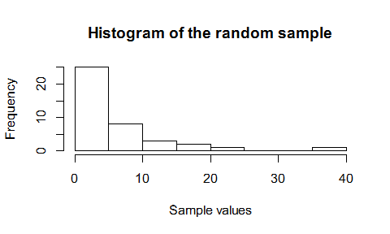
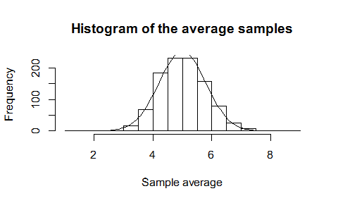
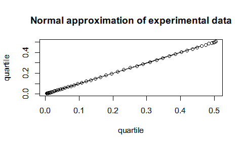

# Assignment 1 simulation
Joris Schut  
Saturday, February 28, 2015  

##Introduction
This document was made in the context of the statistical inference MOOC by Johns Hopkins University as part of the Data Science specialization on Coursera. In this project you will investigate the exponential distribution in R and compare it with the Central Limit Theorem.

##1. Show the sample mean and compare it to the theoretical mean of the distribution.

First, the parameters for the sample size (n; 40), lambda (0.2) and the number of experiments (runs; 1000) was set (values for the parameters were given in the assignment details). In order to create a reproducible analysis, the seed was set to 111.

Using these variables the experiential mean of the experiment was determined. The values of the experiment were then plotted and the value of the mean were printed.

Based on the characteristics of the exponential distribution, the theoretical mean (1/lambda) was calculated for a distribution of 40 exponentials. 

 

```
## [1] "Experimental mean (1 experiment):  5.720125653923 Theoretical mean:  5"
```

The difference between the experiential and theoretical value is given by subtracting both values and taking the absolute value of the result.


```
## [1] "Differnce in means:  0.720125653923001"
```

##2. Show how variable the sample is (via variance) and compare it to the theoretical variance of the distribution

Using the above variables the experiential variance of the experiment was determined. Based on the characteristics of the exponential distribution, the theoretical variance (1/(lambda^2)) was calculated.


```
## [1] "Experimental variance:  48.7762209163615 Theoretical variance:  25"
```

The difference between the experiential and theoretical value is given by subtracting both values and taking the absolute value of the result.


```
## [1] "Differnce invariances:  23.7762209163615"
```

##3 Show that the distribution is approximately normal

1000 experiments were conducted were the mean value of the experiment was stored in the mns variable. Two ways can be used to determine if the distribution of means is normal. First, the histogram of the means be should bell-shaped and can be approximated by a normal distribution density function with the theoretical average for the distribution of a large collection of averages of 40 exponentials and the corresponding standard deviation (Central limit theorem). To compensate for the number of runs the values of the density function should be multiplied by the binwidth of the histogram*number of experiments[2]. The second method involves plotting the quantiles of a normal distribution in the same plot as the quantiles of the experimental data. If they overlap, the distribution of the experimental data is normal.

First, the experiment is run for n=1000 (runs variable) times. The results are appended to the mns variable. Second, the values of the normal approximation are calculated for the distribution of a large collection of averages of 40 exponentials. Further, a normal density function is run to obtain the values used for the approximation.Third, a normal approximation can be simulated by using the the theoretical mean (same as for 1 experiment) for the distribution of a large collection of averages of 40 exponentials and the corresponding standard deviation (sqrt((1/(lambda^2))/n)) (Central limit theorem). To compensate for the number of runs the values of the density function should be multiplied by the binwidth of the histogram*number of experiments[2]. Fourth, the results of both the mns variable and the normal approximation are plotted in a single plot.


```
## [1] "Theoretical mean:  5 Theoretical variance:  0.625"
```

 

As the normal approximation fits pretty good with the histogram, normality of the distribution of the mean can be assumed. This is as stated in the central limit theorem. Using the alternative method (qualtile plot), similar results are found as is shown below.

 


##External sources used for reference
[1] [Wikipedia](http://en.wikipedia.org/wiki/Exponential_distribution#Mean.2C_variance.2C_moments_and_median)

[2] [Fitting a Gausian curve to a histogram](http://www.theinformationlab.co.uk/2013/11/04/fitting-a-gaussian-normal-distribution-curve-to-a-histogram-in-tableau/)

\newpage

##Annex
Code used in this analysis:

```r
#Set parameters
set.seed(111)
n = 40
lambda = 0.2
runs = 1000

#Determine the experimental mean
expvalues <- rexp(n, lambda)
expmean1 <- mean(expvalues)

hist(expvalues, main="Histogram of the random sample", xlab="Sample values")

#Calcualte the theoretical mean[1]
theomean1 <- 1/lambda
print(paste("Experimental mean (1 experiment): ", expmean1, "Theoretical mean: ", theomean1))

#Determine the absolute difference between the theoretical and experimental mean
diffmean1 <- abs(theomean1 - expmean1)
print(paste("Differnce in means: ", diffmean1))

#Determine the experiental variance
expvar1 <- var(expvalues)

#Calculate the theoretical variance[1]
theovar1 <- 1/(lambda^2)
print(paste("Experimental variance: ", expvar1, "Theoretical variance: ", theovar1))

#Determine the absolute difference between the theoretical and experimental variance
diffvar1 <- abs(theovar1 - expvar1)
print(paste("Differnce invariances: ", diffvar1))

#Determine the experimental mean
mns <- NULL
for (i in 1 : runs){
  mns = append(mns, mean(rexp(n, lambda)))
  }

#Calculate theoretical values for the average and the variance
theomean2 <- theomean1
theovar2 <- (1/(lambda^2))/n
print(paste("Theoretical mean: ", theomean2, "Theoretical variance: ", theovar2))

#Create a an normal approximation
binwidth <- 0.5 
x <- seq(-4, 4, length=100)*theovar2 + theomean2
hx <- binwidth*runs*dnorm(x, mean=theomean2, sd=sqrt(theovar2))

#Plot the histogram of the experiments and the normal approximation
hist(mns, breaks=seq(1,9,by=binwidth),main="Histogram of the average samples",
     xlab="Sample average")
lines(x, hx)

#Create the quartile values for the experimental and theoretical values
histmns <- hist(mns, breaks=seq(1,9,by=binwidth), plot=FALSE)
fmns<- histmns$density
pmns <- pnorm(fmns, mean=theomean2, sd=sqrt(theovar2))
qmns <- qnorm(pmns, mean=theomean2, sd=sqrt(theovar2))

px <- pnorm(hx/(binwidth*runs), mean=theomean2, sd=sqrt(theovar2))
qx <- qnorm(px, mean=theomean2, sd=sqrt(theovar2))

#plot the theorethical and experimental values in a single plot
plot(qx, qx, main="Normal approximation of experimental data", xlab="quartile",
     ylab="quartile")
lines(qmns, qmns)
```
